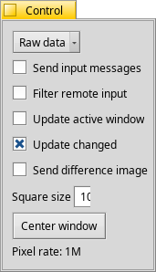

# RemoteControl

An application to control a remote PC



RemoteControl is an application that allows the user to control a remote PC. It can be
useful if you have a PC with no screen, keyboard or mouse connected, or simply if 
it is too far away.

### Features

* The events from the mouse and keyboard can be set to interact with the remote PC
* It is possible to filter the events generated by the remote mouse and keyboard.
* The screen is decomposed in several squares. Only the squares that need to be 
updated are compressed with the translator of your choice and sent to the client.

### How to use it ?

Once the server is installed and running, launch the client from the terminal:

```
RCClient <hostname>
```

Where hostname is the name or the IP address of the target


